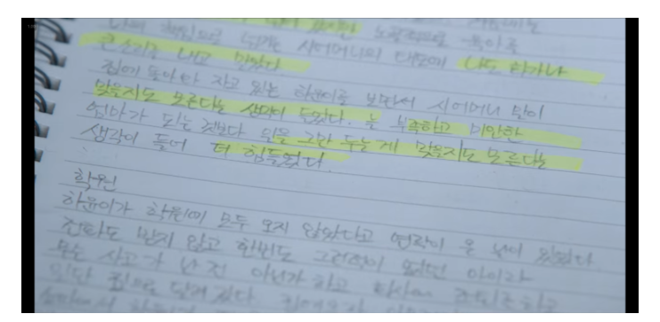

# DIARY_TEST

# 주제 선정 이유

넷플릭스 드라마 중 정신 병동에 나오는 메타인지 치료법 중 하나인 자서전 작성을 보고 앱에 적용해보자! 생각이 들어 다이어리 작성을 주제로 잡게 되었습니다. 
# 시작 페이지
다이어리 소개글 작성

# 일기 작성 페이지

기분 정도를 나타내는 슬라이드 생성 
- 기분 슬라이더 값을 날짜 별로 저장해서 기분 그래프 생성(미완)

일기 작성 후 "diary.csv" 파일에 {날짜, 내용} 딕셔너리 형식으로 저장
- 원하는 날짜를 입력 받아 그 날짜에 해당하는 일기 내용을 불러와 사용자가 볼 수 있게 해주는 기능 추가 (미완)

# chat bot 페이지

"wellness dataset.csv" 파일을 활용해 사용자 고민을 들어주거나 대화의 상대가 되어주는 chat bot 생성

# to-do 페이지

하루 해야 할 것들을 작성 
-> 누적되어야 함

체크 박스 누르면 사라짐
